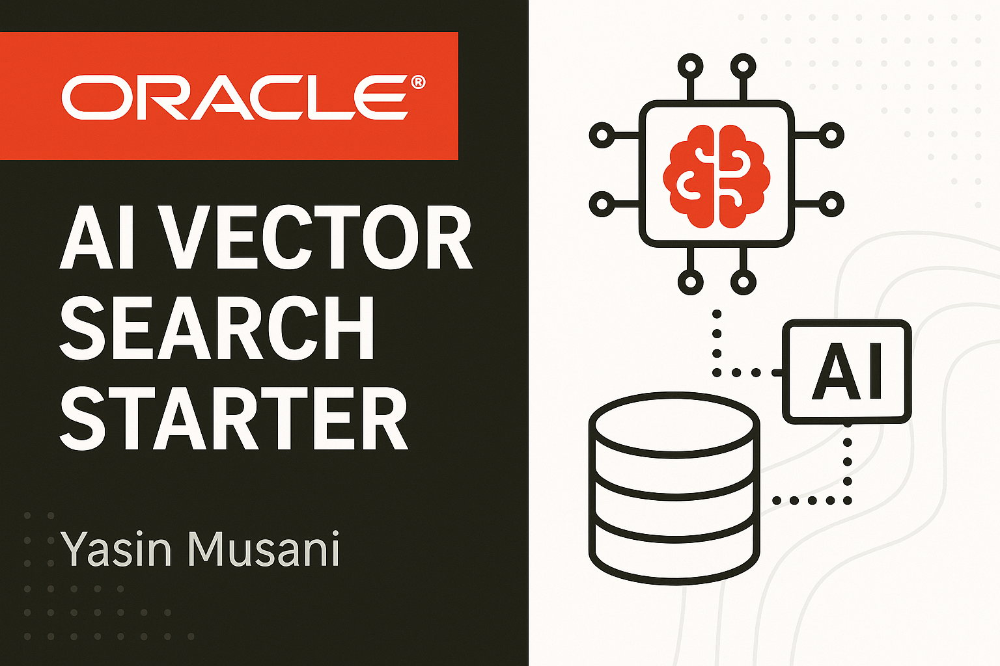

# Oracle AI Vector Search Starter



This is a Python + Oracle Database 23ai sample project that uses AI vector search capabilities and Hugging Face embeddings to perform semantic product search.

## 🔧 Features

- Connects to Oracle DB 23ai
- Embeds product descriptions using Hugging Face Transformers
- Stores vector embeddings in Oracle using `VECTOR_SEARCH`
- Simple Flask API for querying products with natural language

## 🛠 Tech Stack

- Oracle Database 23ai
- Python 3.x
- Flask
- Hugging Face Transformers (e.g. `sentence-transformers/all-MiniLM-L6-v2`)
- oracledb (Python client)
- Pandas

## ⚙️ Setup

1. Clone the repo:
   ```bash
   git clone https://github.com/yasinmusani/oracle-ai-vector-search.git
   cd oracle-ai-vector-search
